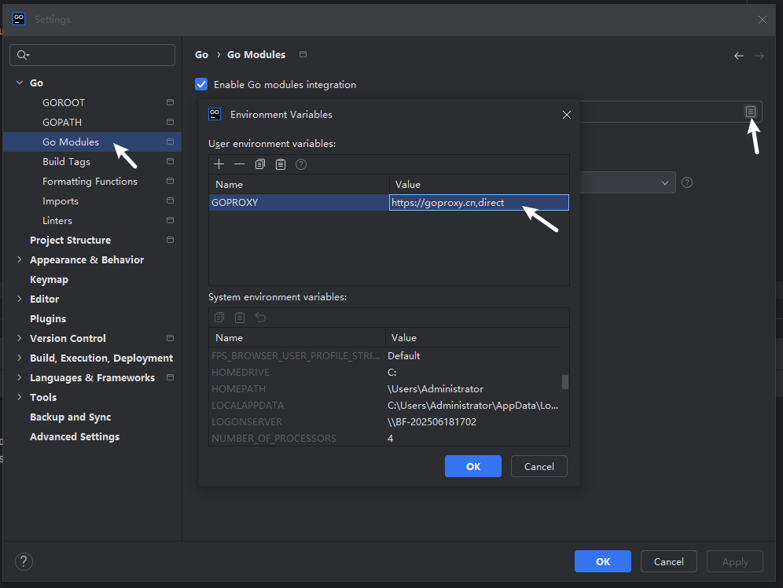

golang 下载地址：https://go.dev/dl/

## Windows

直接安装即可

可将 `golang\bin` 添加到环境变量中，输入校验是否安装成功

```bash
go version
```

## 配置

### GoPath

GOPATH 是 Go 语言的工作目录（工作区），它是 Go 项目存放代码、依赖和编译后的二进制文件的地方。

```bash
go env -w GOPATH="gopath路径"
```

### GoModule

**开启模块支持**

```bash
go env -w GO111MODULE=on
```

**设置代理**

```bash
# 官网全球代理
go env -w GOPROXY=https://goproxy.io,direct
# 七牛云代理（推荐）
go env -w GOPROXY=https://goproxy.cn,direct
```

> 检查是否生效 ，打开 `cmd` 输入
>
> ```bash
> go env GOPROXY
> ```
>
> 输出 `https://goproxy.cn,direct` 的话即代表成功

**取消代理**

```bash
go env -w GOPROXY=direct
```

## 编程工具

### Goland

**设置 GoModule**



**设置 GoPath**


#### 错误处理

- 运行报错：WARNING: undefined behavior - version of Delve is too old for Go version go1.25.0 (maximum supported version 1.24)

  安装：

  ```bash
  go install github.com/go-delve/delve/cmd/dlv@master
  ```

  修改 goland 配置：`Help\Edit Custom Properties`，新增配置：

  ```
  dlv.path=D:\\devtool\\golang\\gopath\\bin\\dlv.exe
  ```

  这个路径是 `gopath` 配置后的路径，默认在c盘 `dlv.path=C:\\Users\\_user_\\go\\bin\\dlv.exe`

### VSCode

安装必要扩展 `go` ，可选扩展 `Code Runner`

修改配置

```json title=".vscode/settings.json"
{
  "go.gopath": "D:\\devtool\\golang\\gopath",
  // goroot 是go的安装路径
  "go.goroot": "D:\\devtool\\golang\\go1.25.3"
}
```

记得配置 `GoModule` 的代理


