> 背景：现在使用 HBuilderX 打自定义基座的话，一个账号会有限制次数。并且时间过慢。

## 1. 安装 Android Studio

使用该工具进行自定义基座。

下载地址：https://developer.android.com/studio?hl=zh-cn

按照顺序安装即可，注意SDK的位置不要安装到C盘

## 2. 下载 HBuilderX 离线SDK

下载地址：https://nativesupport.dcloud.net.cn/AppDocs/download/android.html

**注意：下载的 SDK 的版本需要与 HBuilderX 的版本保持一致。**

历史版本：https://pan.baidu.com/share/init?surl=KtOCtMZJSgfAayHNjTpdTg&pwd=4hvi

## 3. 导入 HBuilder-Integrate-AS 项目到 Android Studio

解压从 HBuilderX 下载后的 Android-SDK，使用 Android Studio 打开解压后的 HBuilder-Integrate-AS 项目。

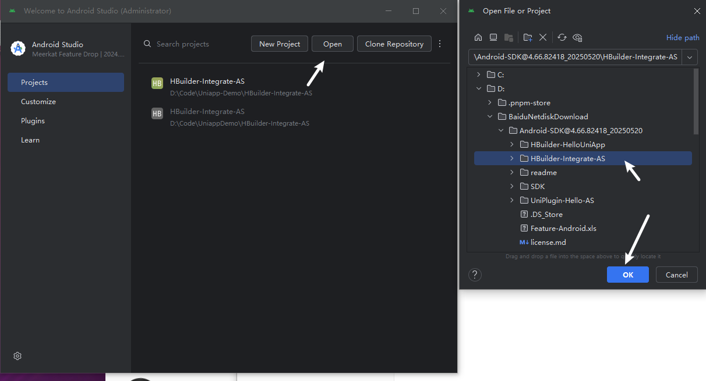

导入成功后，会发现目录只有部分内容。

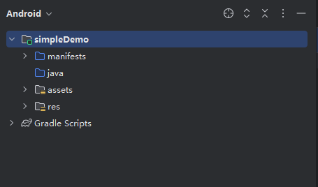

这时候需要将 Android 更新为 Project 既可查看到项目全部内容

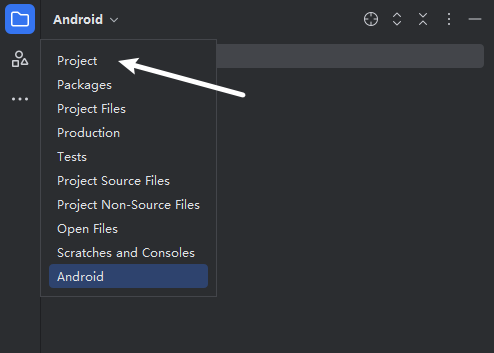

修改后的效果

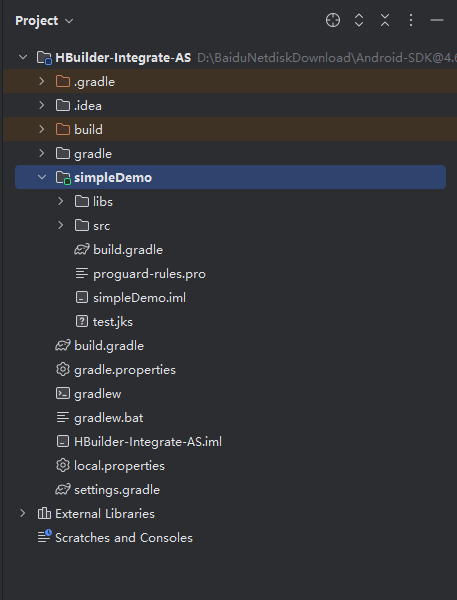

## 4. 配置 Andriod Studio

配置 JDK ，配置路径：Settings - Build - Build Tools - Gradle

将 Gradle JDK 的路径修改为本地的路径，修改后点击 `Apply` 即可。注意：JDK 的版本需要和 Gradle 的版本进行适配，如果不适配那么运行的时候也会有详细的报错信息。

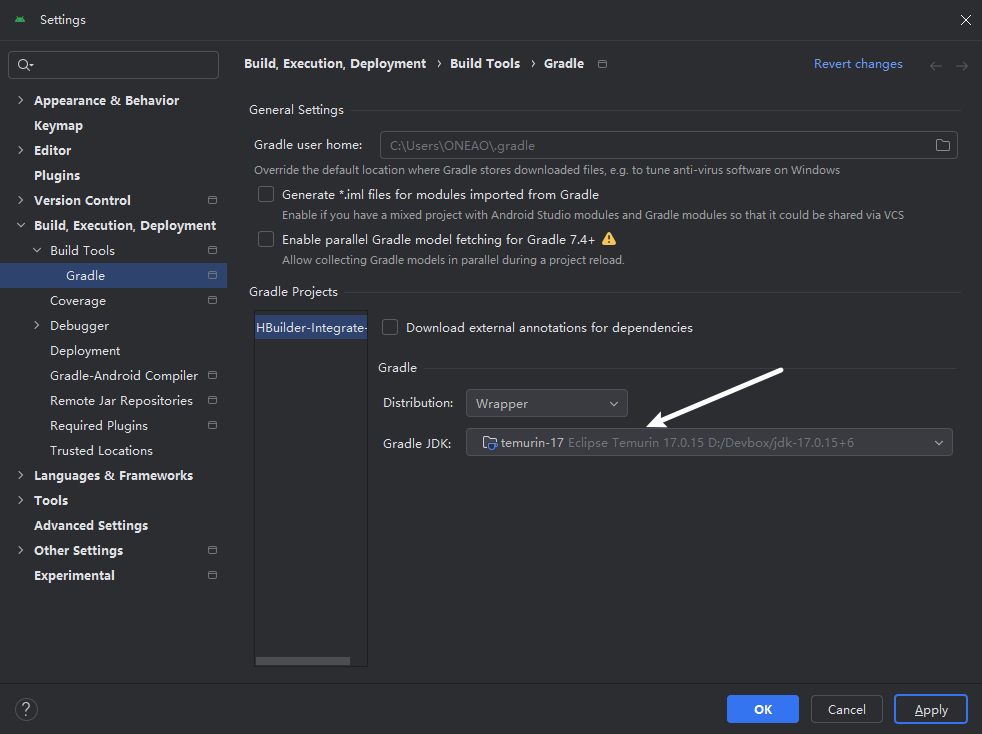

## 5. Uniapp开发者中心 申请相关信息

### 5.1 创建应用

首先根据应用名称检查是否已经存在当前的项目。

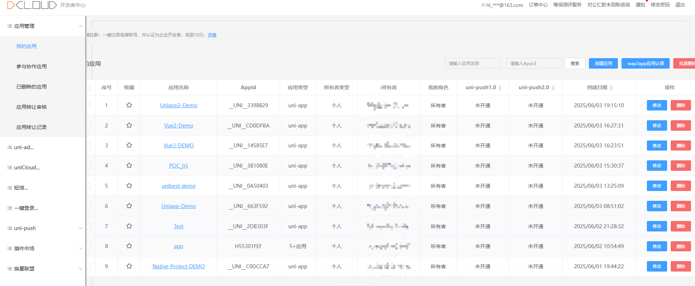

有过没有的话则点击右上角的 `创建应用` 按钮进行创建：

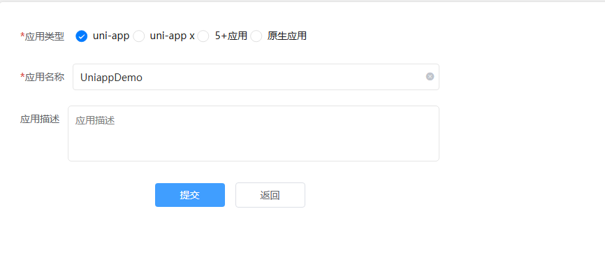

创建成功后会添加到 **我的应用** 列表中

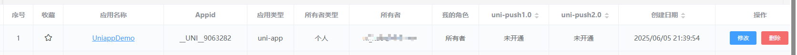

点击对应的 **应用名称** 即可进入对应的应用

### 5.2 申请云端证书

点击创建证书

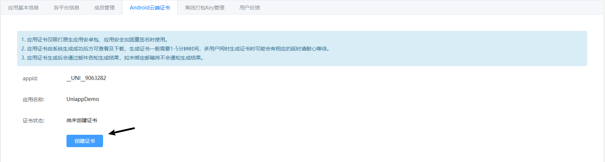

因为需要时间，过段时间刷新即可

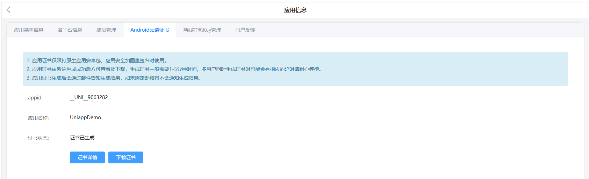

创建成功后，点击 **证书详情 ** 这里面有需要的一些信息。

需要的有 别名、MD5、SHA1、SHA256

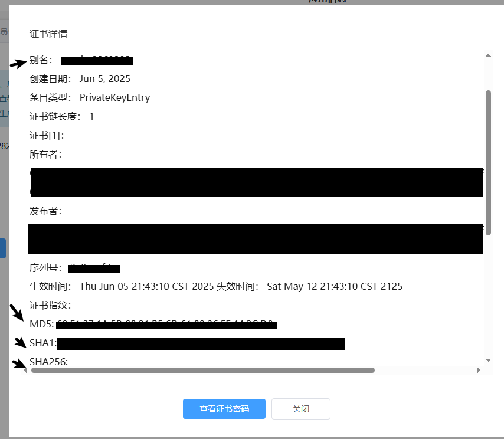

同时还需要证书密码，点击 **查看证书密码 ** 即可获取到。

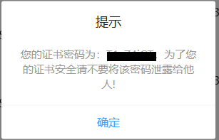

现在记录的信息有： 别名、MD5、SHA1、SHA256、证书密码

注意下载申请过的证书，后面需要用到

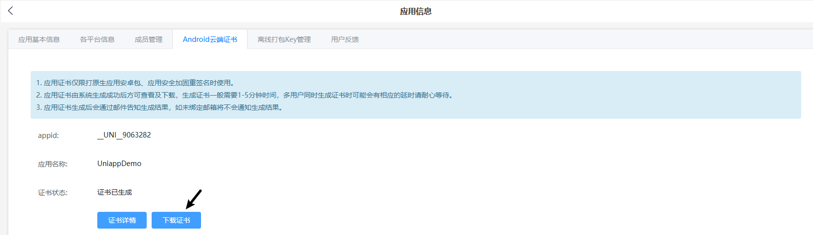

### 5.3 新增平台信息

进入 **各平台信息** ，点击 **新增** 按钮

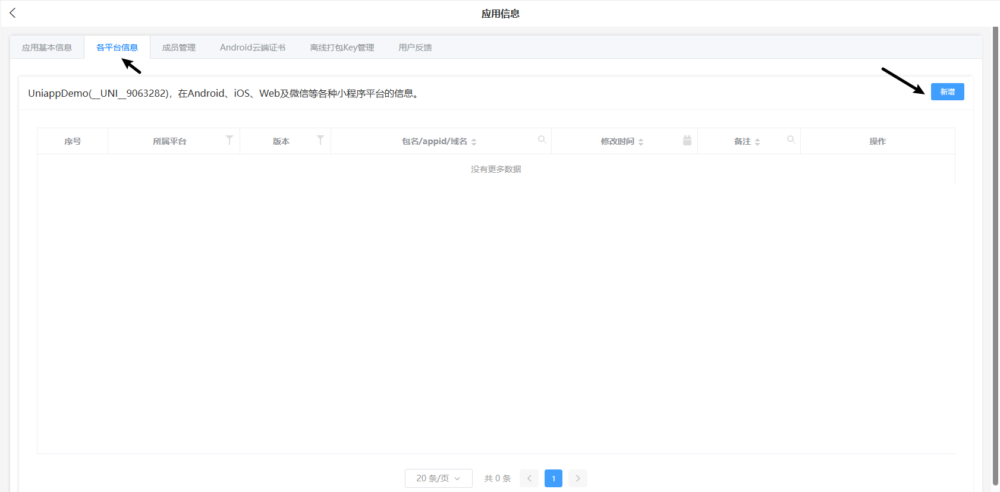

填写以下信息，注意填写包名（任意），该包名后面使用到。这个时候 SHA1、MD5、SHA256 就是在 [5.2 申请云端证书](#52-申请云端证书) 章节申请的信息。

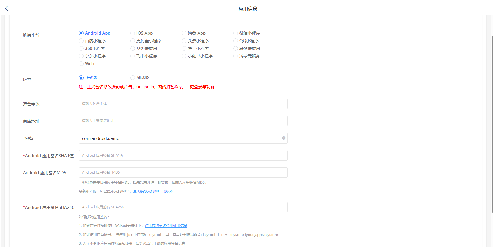

创建成功后就会显示

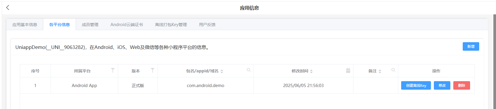

创建离线Key，点击刚刚创建的平台信息的 创建离线Key 按钮

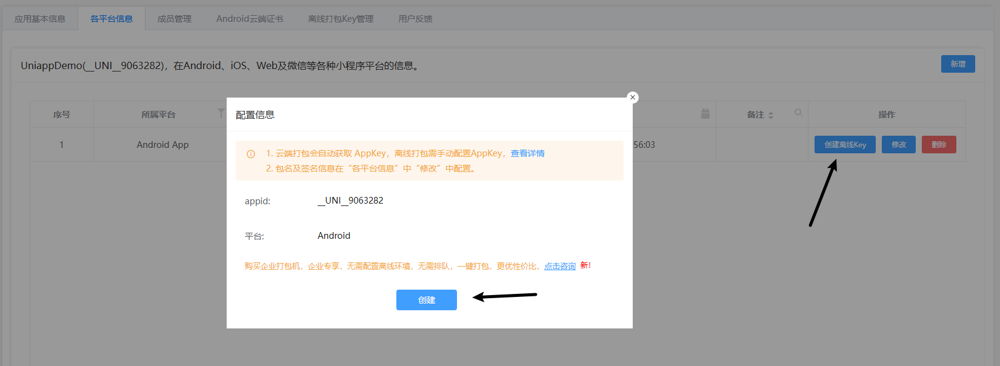

点击进行创建，创建成功后，会显示 **查看离线Key**

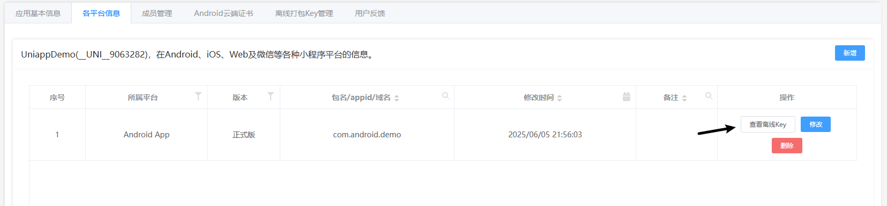

点击查看对应的离线Key，主要保留该值，后面会用到

## 6. 配置导入过的 HBuilder-Integrate-AS 项目

配置 `HBuilder-Integrate-AS\simpleDemo\build.gradle` ，这些修改的信息 已经都在 [5. Uniapp开发者中心 申请相关信息](#5-Uniapp开发者中心 申请相关信息) 申请过了，我已标注。注意下载云端证书，并放到 simpleDemo 目录下。

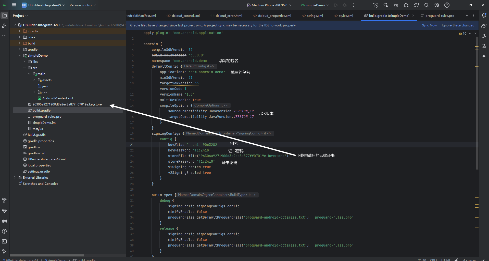

替换 离线Key（该值就在 [5.3 新增平台信息](#53-新增平台信息) 申请过了），配置 `HBuilder-Integrate-AS\simpleDemo\src\main\AndroidManifest.xml` 文件。

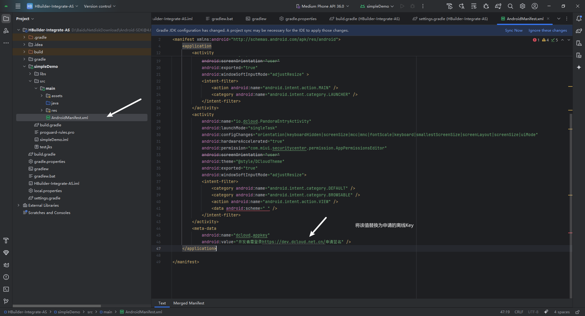

配置 `HBuilder-Integrate-AS\simpleDemo\src\main\assets\data\dcloud_control.xml` ，替换自己项目的appid。

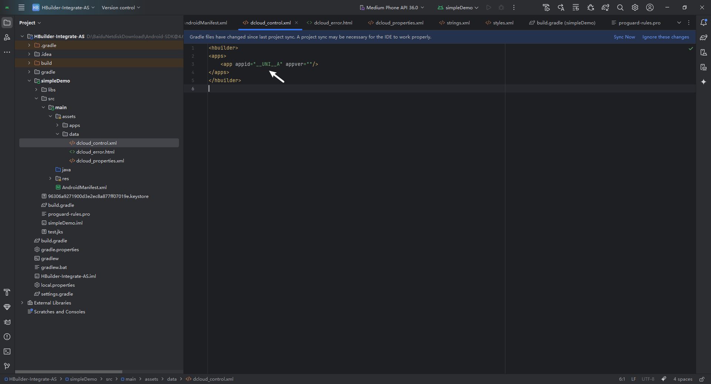

## 7. Hbuilder X 导出本地打包资源

注意 APPID 需要和创建应用的 appid 保持一致。如果不一致，可以去源码视图进行修改

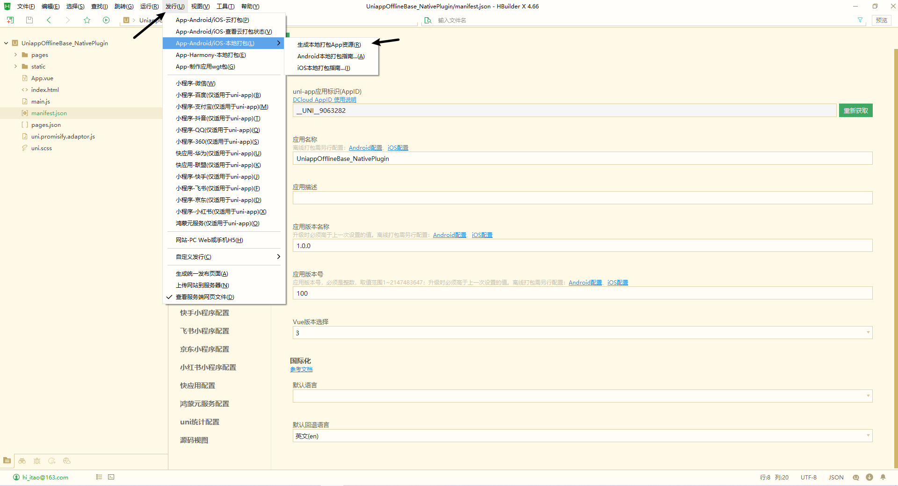

导出成功后，路径参考：

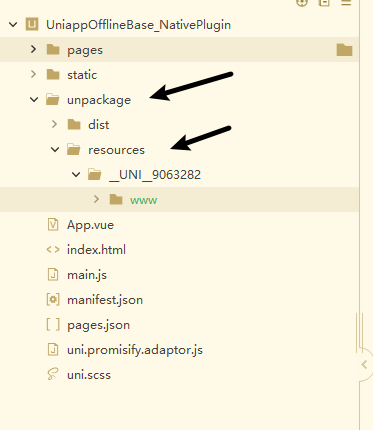

复制 **resources** 文件夹下面文件夹，然后替换 **HBuilder-Integrate-AS** 项目中的 `HBuilder-Integrate-AS\simpleDemo\src\main\assets\apps\__UNI__A` 目录，将 `__UNI__A` 文件夹替换为导出的 `__UNI__9063282` 文件夹，替换后如下：


确保 应用版本名称 和 应用版本号保持一致

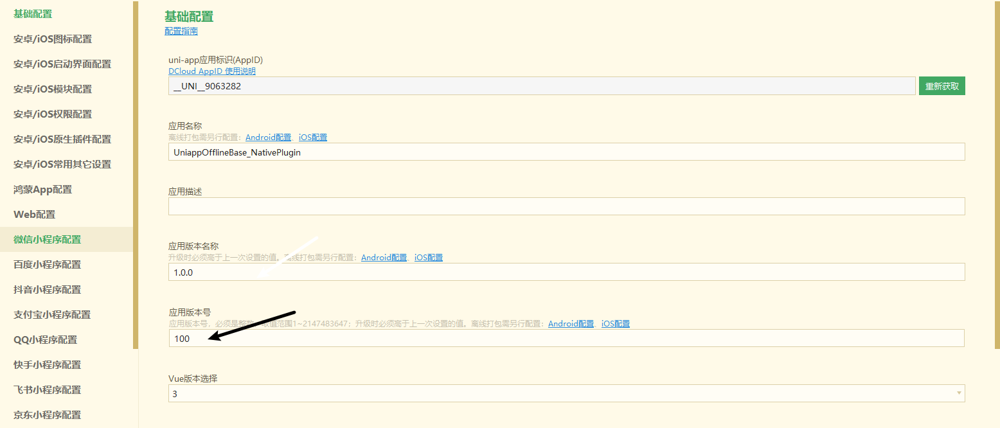

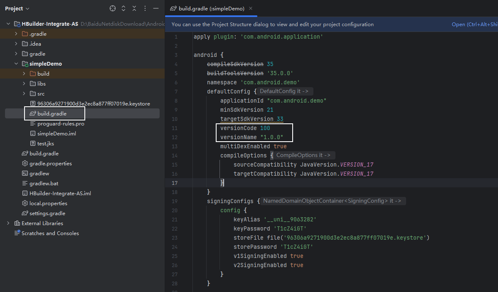

## 8. 运行项目

先进行加载配置好的项目


加载成功后即可出现蓝色运行按钮，点击运行即可

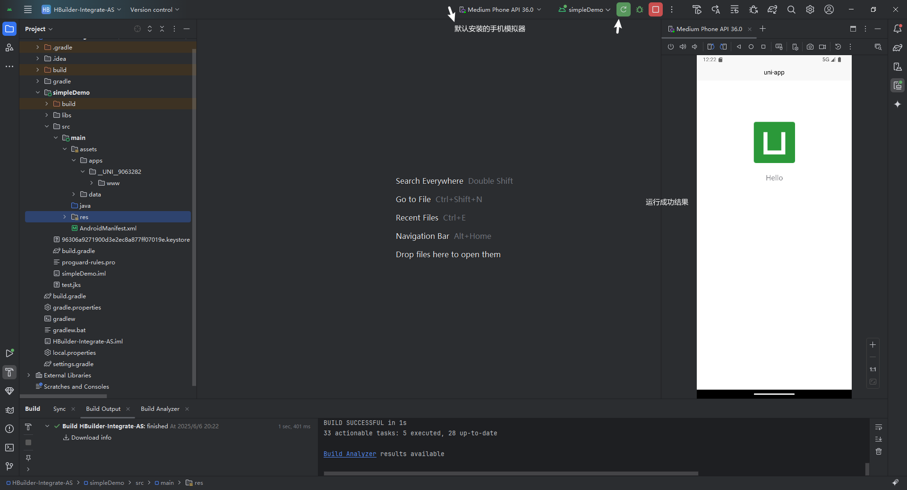

## 9. 导入原生插件

> 如果不需要该步可以忽略，不影响自定义基座。

参考网站：https://zh.uniapp.dcloud.io/plugin/native-plugin.html#%E6%9C%AC%E5%9C%B0%E6%8F%92%E4%BB%B6-%E9%9D%9E%E5%86%85%E7%BD%AE%E5%8E%9F%E7%94%9F%E6%8F%92%E4%BB%B6

### 9.1 下载插件

这里用 **DCloud-RichAlert** 举例，插件下载地址：https://ext.dcloud.net.cn/plugin?id=36

下载完毕后，新建 **nativeplugins** 文件夹，将解压后的插件放到该文件夹下面


9.2 配置本地插件

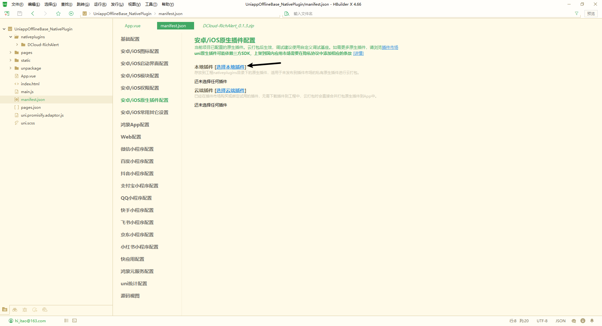

选择插件

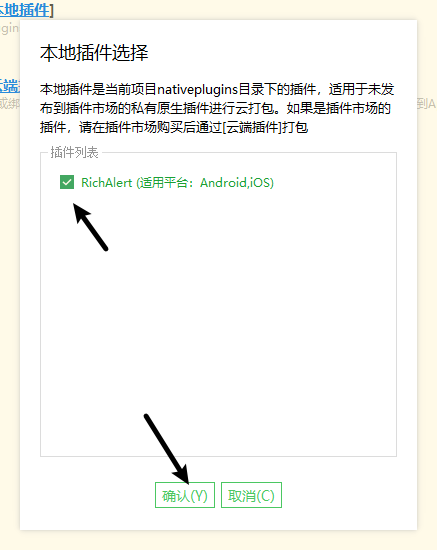

配置成功页面

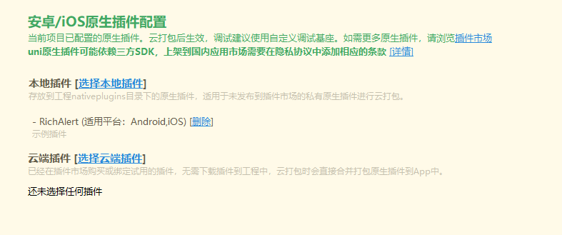

然后就可以使用啦，在页面中添加测试代码

```html
<template>
  <view class="content">
    <image class="logo" src="/static/logo.png"></image>
    <view class="text-area">
      <text class="title">{{title}}</text>
    </view>
  </view>
</template>

<script>
  export default {
    data() {
      return {
        title: 'Hello',
      }
    },
    onLoad() {
      const dcRichAlert = uni.requireNativePlugin('DCloud-RichAlert')
      dcRichAlert.show(
        {
          position: 'bottom',
          title: '提示信息',
          titleColor: '#FF0000',
          content:
            "<a href='https://uniapp.dcloud.io/' value='Hello uni-app'>uni-app</a> 是一个使用 Vue.js 开发跨平台应用的前端框架!\n免费的\n免费的\n免费的\n重要的事情说三遍",
          contentAlign: 'left',
          checkBox: {
            title: '不再提示',
            isSelected: true,
          },
          buttons: [
            {
              title: '取消',
            },
            {
              title: '否',
            },
            {
              title: '确认',
              titleColor: '#3F51B5',
            },
          ],
        },
        (result) => {
          switch (result.type) {
            case 'button':
              console.log('callback---button--' + result.index)
              break
            case 'checkBox':
              console.log('callback---checkBox--' + result.isSelected)
              break
            case 'a':
              console.log('callback---a--' + JSON.stringify(result))
              break
            case 'backCancel':
              console.log('callback---backCancel--')
              break
          }
        },
      )
    },
    methods: {},
  }
</script>

```

当然，现在还没有结束，如果需要在本地看到效果，需要重复 [7. Hbuilder X 导出本地打包资源](#7-Hbuilder X 导出本地打包资源) 步骤，将新的打包资源将旧的替换掉。

### 9.3 配置项目

**重要的下一步**，将 `nativeplugins\DCloud-RichAlert\android\uniplugin_richalert.aar` 复制到 `HBuilder-Integrate-AS\simpleDemo\libs` 文件夹下。

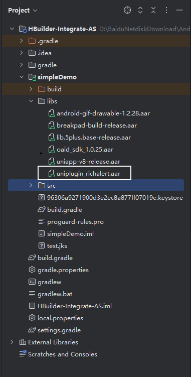

然后呢，还没有结束哦。

在assets目录下创建 **dcloud_uniplugins.json** 文件，添加以下内容

```json
{  
  "nativePlugins": [  
    {
      "plugins": [  
        {  
          "type": "module",  
          "name": "DCloud-RichAlert",  
          "class": "uni.dcloud.io.uniplugin_richalert.RichAlertWXModule"  
        }  
      ]  
    }  
  ]  
}
```
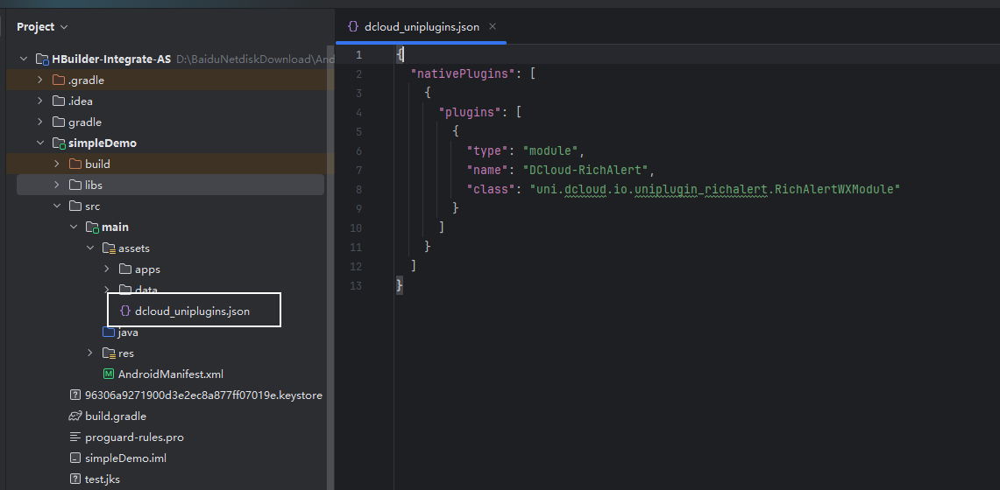

### 9.4 配置gradle文件

添加制定依赖。

```
dependencies {
    implementation fileTree(dir: 'libs', include: ['*.aar', '*.jar'], exclude: [])
    implementation 'androidx.appcompat:appcompat:1.1.0'
    implementation 'androidx.localbroadcastmanager:localbroadcastmanager:1.0.0'
    implementation 'androidx.core:core:1.1.0'
    implementation "androidx.fragment:fragment:1.1.0"
    implementation 'androidx.recyclerview:recyclerview:1.1.0'
    implementation 'com.facebook.fresco:fresco:2.5.0'
    implementation "com.facebook.fresco:animated-gif:2.5.0"
    implementation 'com.github.bumptech.glide:glide:4.9.0'
    implementation 'com.alibaba:fastjson:1.2.83'
    implementation 'androidx.webkit:webkit:1.5.0'
    // 基座需要，必须添加。主要是这个是
    implementation 'com.github.bumptech.glide:glide:4.9.0'
}
```

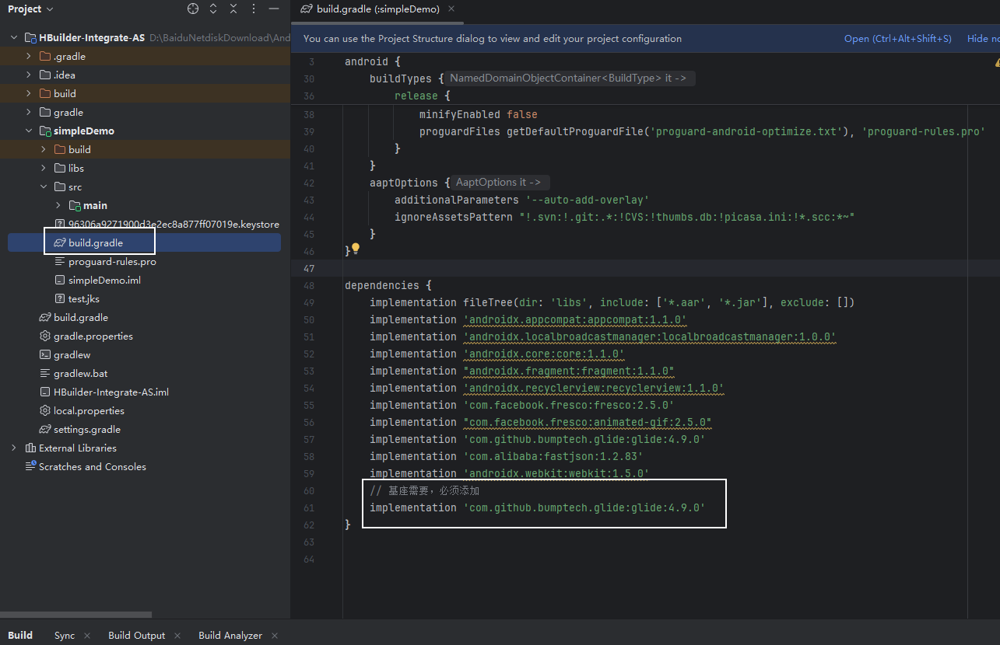

### 9.5 运行项目

然后就是可以重新运行项目啦。运行成功的结果如下：

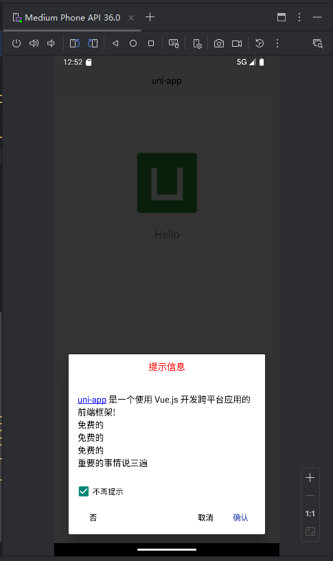

## 10. 自定义基座

### 10.1 Debug 配置

修改 `HBuilder-Integrate-AS\simpleDemo\src\main\assets\data\dcloud_control.xml` 文件，设置 Debug 模式：

```xml
<hbuilder debug="true" syncDebug="true">
<apps>
    <app appid="__UNI__ID" appver=""/>
</apps>
</hbuilder>
```

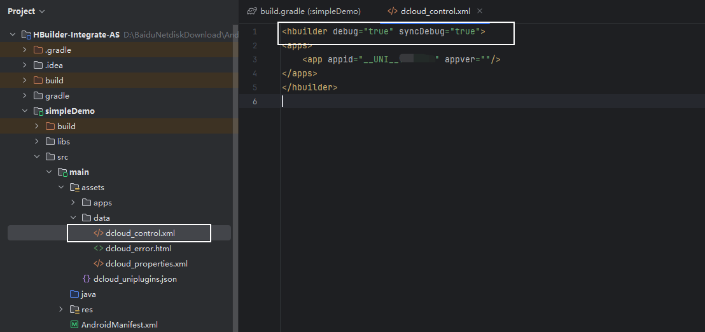

修改 `HBuilder-Integrate-AS\simpleDemo\build.gradle`  在该文件中添加 **okhttp3** 依赖

```
dependencies {  
    implementation "com.alibaba:fastjson:1.2.83"  
    implementation "com.squareup.okhttp3:okhttp:3.12.12"  
}
```

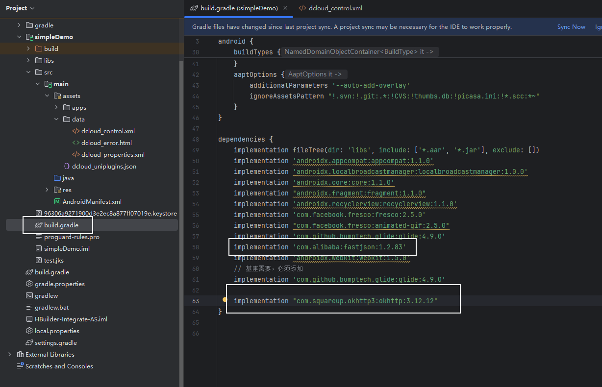

### 10.2 导入 Debug SDK

需要导入的 SDK 位于 `Android-SDK@4.66.82418_20250520\SDK\libs` 中

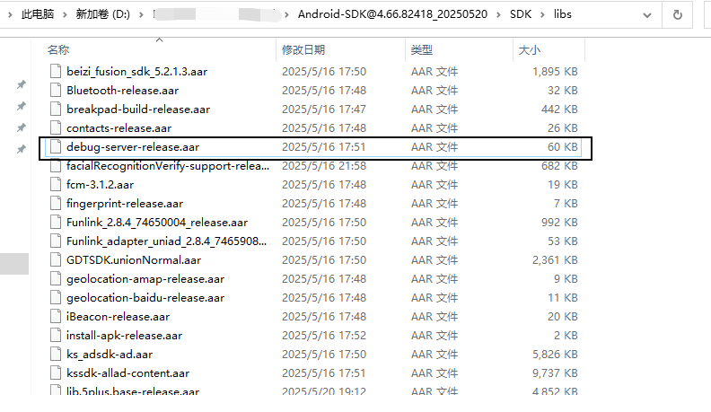

将 **debug-server-release.aar** 复制到 **libs** 下面

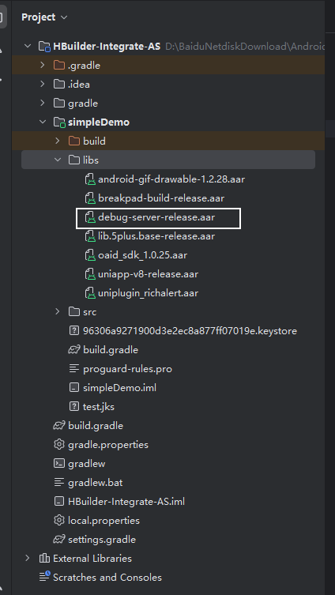

### 10.3 生成APK文件

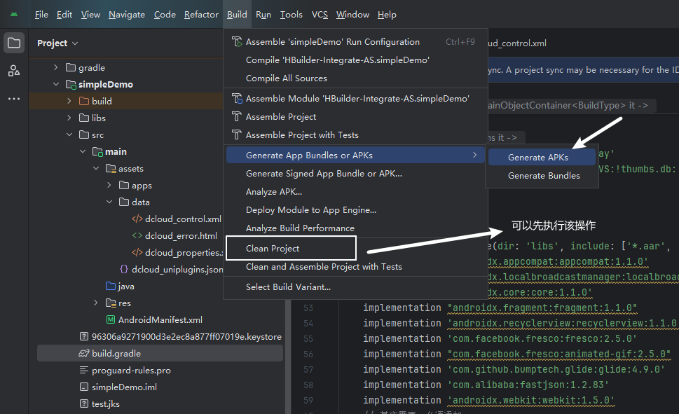

生成后会生成在 debug 目录下

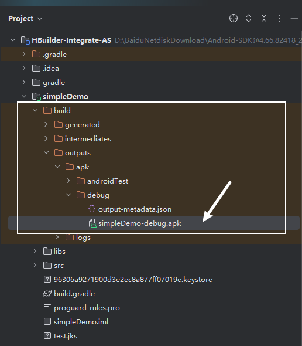

### 10.4 复制APK文件到HBuilderX中

1. 在HBuilderX项目中创建创建 unpackage 目录，在 unpackage 目录中创建 debug 目录，将上述生成的APK文件拷贝到debug目录中。
2. **重命名**文件为 **android_debug.apk**，目录结构参考下图
   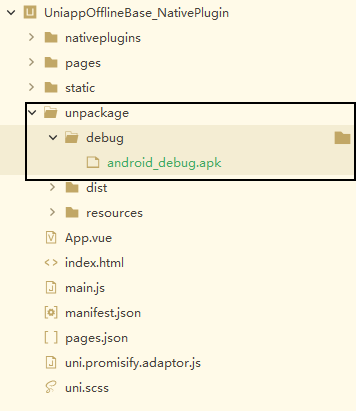

### 10.5 运行自定义基座

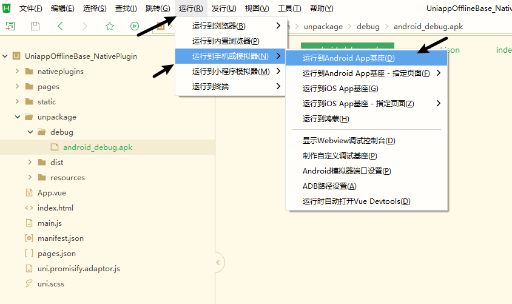

选择自定义基座

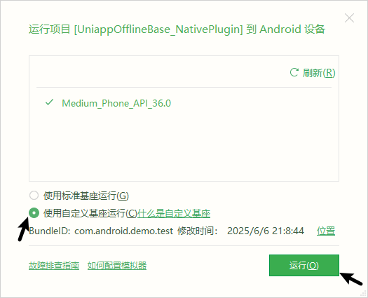

点击运行，运行结果如下：


同时能支持 **热更新** 。修改下，查看效果吧。

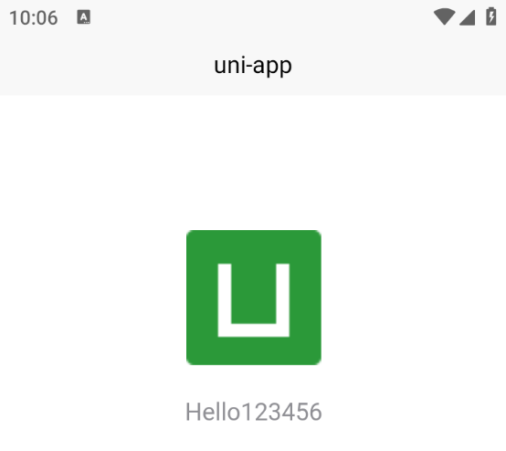

## 11. 模块及三方 SDK 配置

参考官网：https://nativesupport.dcloud.net.cn/AppDocs/usemodule/androidModuleConfig/others.html