> 具体可参考：https://docusaurus.io/zh-CN/docs/search

[Algolia](https://dashboard.algolia.com) 是一个强大的搜索引擎平台，专注于提供快速、可定制的搜索功能。它通常用于为网站、应用或文档提供实时搜索和自动完成功能。

## 1. 配置 algolia

先到 [官网](https://dashboard.algolia.com) 注册申请，大概两天后会收到邮件通知注册成功，再接着往下操作（不确定是否需要这步）

### 申请 Application

点击 `+ Create Application` 申请新的应用


申请表单填写步骤：

- 输入名称
- `Select your Search plan` 选择 `Algolia` 即可，`DocSearch` 需要申请，但是允许查询次数比较多
- 地区随便选择一个即可

### 申请 Index

点击菜单栏的 `Search` 或直接搜索栏搜索 Index 进入 Index 相关页面

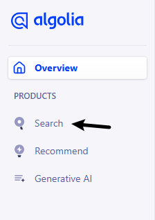

进入页面后，点击 `Create Index` 创建 Index

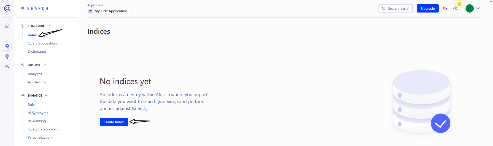

接下来填写 Index 的名称即可

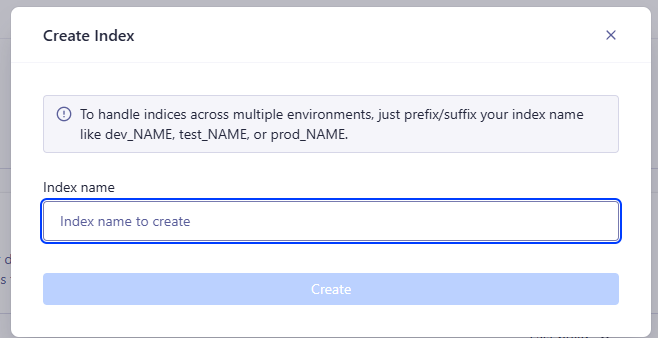

### 配置 Index(重要)

> 不要忽略这一步，不然会导致搜索不到内容

找到 Index 页面中的 `Configuration` 选项

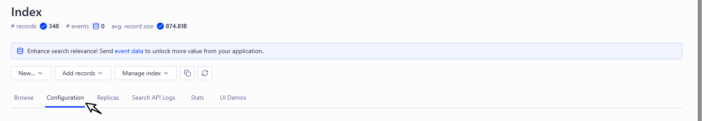

下面需要修改3处地方

**Searchable attributes** 的值新增：

```
title
content
keywords
description
lang
language
hierarchy.lvl0
hierarchy.lvl1
hierarchy.lvl2
hierarchy.lvl3
hierarchy.lvl4
hierarchy.lvl5
hierarchy.lvl6
```

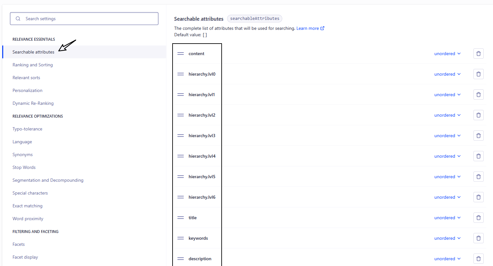

**Facts** 的值新增：

```
category
content
docusaurus_tag
lang
language
hierarchy.lvl0
hierarchy.lvl1
hierarchy.lvl2
hierarchy.lvl3
hierarchy.lvl4
hierarchy.lvl5
hierarchy.lvl6
```

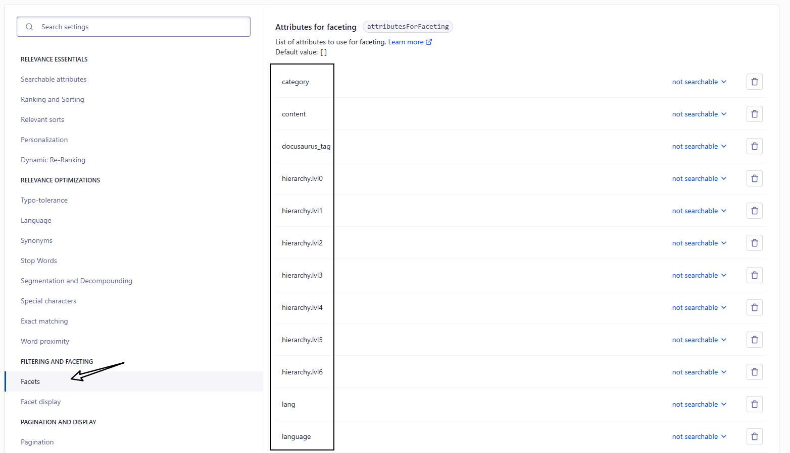

**Languages** 的值新增：

Index Languages 和 Query Languages 都需要添加

```
Chinese
English
```

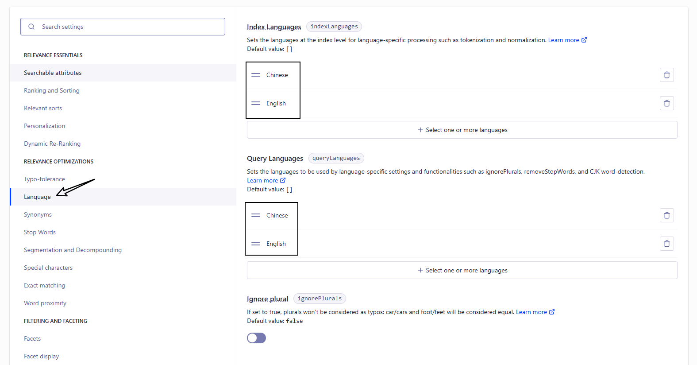

## 2. 修改 docusaurus.config.js

```json
{
  "config": {
    "themeConfig": {
      "algolia": {
        "appId": "填写申请的appId",
        "apiKey": "填写申请的apiKey",
        "indexName": "填写申请的indexName"
      }
    }
  }
}
```

需要填写的信息可以在[该页面](https://dashboard.algolia.com/account/overview)中进行查找

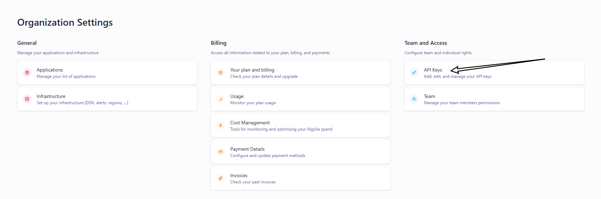

进入该页面后即可查询到 `appId` 和 `apiKey`

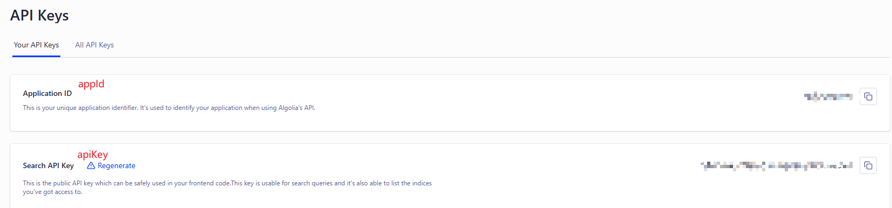

- `appId`：就是申请的 Application ID
- `apiKey`：就是 Search API Key
- `IndexName`：就是申请的 Index 的名称

这样就会自动在 `navbar` 添加个搜索框

## 3. 爬虫

爬虫就是将自己网站的信息爬到 algolia 网站上，在这分为两种：

- algolia爬虫：使用 algolia 网站上的爬虫进行爬取（这个好像也需要申请）
- 自定义爬虫：配置一个自定义爬虫，使用 Docker 或 GitHub Actions 来自动化执行爬虫任务

### algolia爬虫

还是进入 Index 页面，点击 `event data`

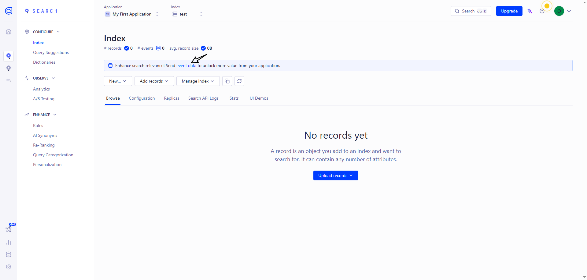

点击 `Crawler` 里面的 `Add your domain`

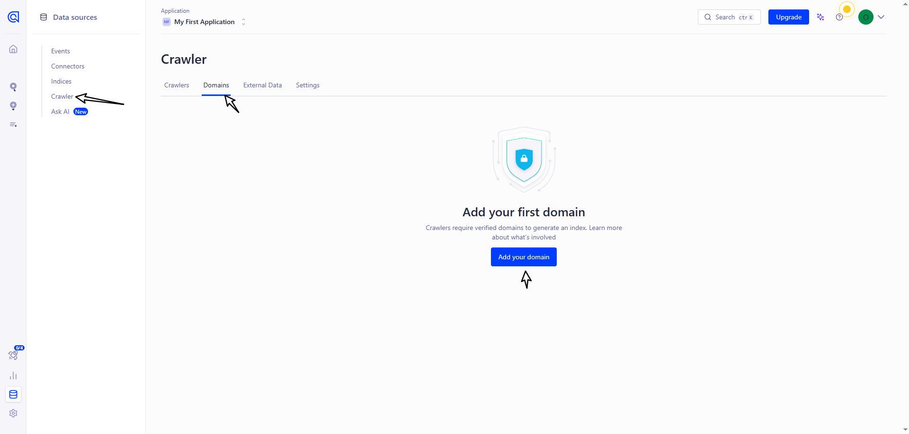

然后输入自己的网址进行验证，可选择多种方式

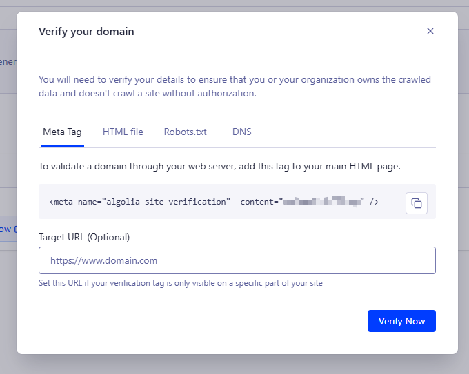

验证成功后，新建爬虫信息

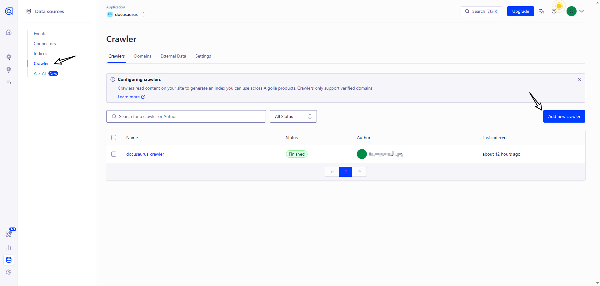

填写相关信息

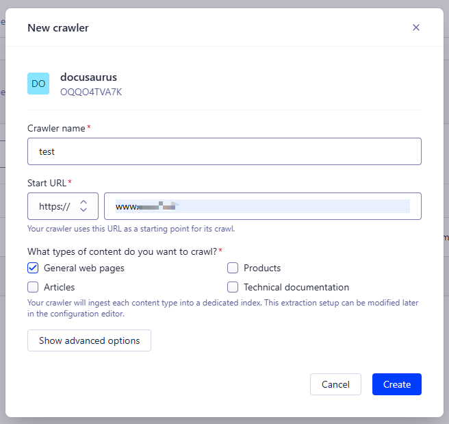

创建成功后，点击 Index 名称进入爬虫页面

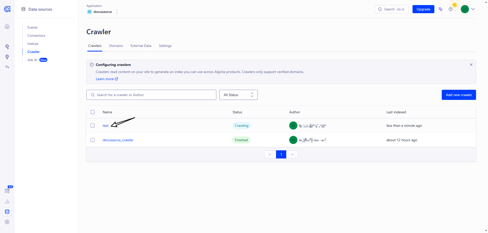

默认创建好就进行爬虫了，但是配置信息需要改下，配置参考 [官方推荐](https://docsearch.algolia.com/docs/templates/#docusaurus-v3-template)

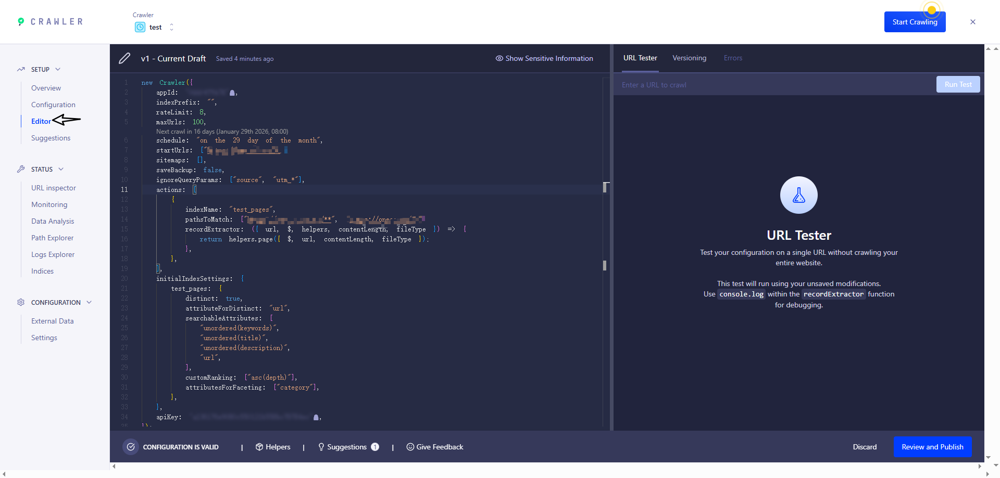

```js title="Editor"
new Crawler({
  appId: 'YOUR_APP_ID',
  apiKey: 'YOUR_API_KEY',
  rateLimit: 8,
  maxDepth: 10,
  // 每天0点爬取一次
  schedule: 'every 1 day at 12:00 am',
  startUrls: ['https://YOUR_WEBSITE_URL/'],
  sitemaps: ['https://YOUR_WEBSITE_URL/sitemap.xml'],
  ignoreCanonicalTo: true,
  discoveryPatterns: ['https://YOUR_WEBSITE_URL/**'],
  actions: [
    {
      indexName: 'YOUR_INDEX_NAME',
      pathsToMatch: ['https://YOUR_WEBSITE_URL/**'],
      recordExtractor: ({ $, helpers }) => {
        // priority order: deepest active sub list header -> navbar active item -> 'Documentation'
        const lvl0
          = $(
            '.menu__link.menu__link--sublist.menu__link--active, .navbar__item.navbar__link--active'
          )
            .last()
            .text() || 'Documentation'

        return helpers.docsearch({
          recordProps: {
            lvl0: {
              selectors: '',
              defaultValue: lvl0,
            },
            lvl1: ['header h1', 'article h1'],
            lvl2: 'article h2',
            lvl3: 'article h3',
            lvl4: 'article h4',
            lvl5: 'article h5, article td:first-child',
            lvl6: 'article h6',
            content: 'article p, article li, article td:last-child',
          },
          indexHeadings: true,
          aggregateContent: true,
          recordVersion: 'v3',
        })
      },
    },
  ],
  initialIndexSettings: {
    YOUR_INDEX_NAME: {
      attributesForFaceting: [
        'type',
        'lang',
        'language',
        'version',
        'docusaurus_tag',
      ],
      attributesToRetrieve: [
        'hierarchy',
        'content',
        'anchor',
        'url',
        'url_without_anchor',
        'type',
      ],
      attributesToHighlight: ['hierarchy', 'content'],
      attributesToSnippet: ['content:10'],
      camelCaseAttributes: ['hierarchy', 'content'],
      searchableAttributes: [
        'unordered(hierarchy.lvl0)',
        'unordered(hierarchy.lvl1)',
        'unordered(hierarchy.lvl2)',
        'unordered(hierarchy.lvl3)',
        'unordered(hierarchy.lvl4)',
        'unordered(hierarchy.lvl5)',
        'unordered(hierarchy.lvl6)',
        'content',
      ],
      distinct: true,
      attributeForDistinct: 'url',
      customRanking: [
        'desc(weight.pageRank)',
        'desc(weight.level)',
        'asc(weight.position)',
      ],
      ranking: [
        'words',
        'filters',
        'typo',
        'attribute',
        'proximity',
        'exact',
        'custom',
      ],
      highlightPreTag: '<span class="algolia-docsearch-suggestion--highlight">',
      highlightPostTag: '</span>',
      minWordSizefor1Typo: 3,
      minWordSizefor2Typos: 7,
      allowTyposOnNumericTokens: false,
      minProximity: 1,
      ignorePlurals: true,
      advancedSyntax: true,
      attributeCriteriaComputedByMinProximity: true,
      removeWordsIfNoResults: 'allOptional',
      separatorsToIndex: '_',
    },
  },
})
```

> 注意：`schedule` 现在是每天0点自动爬取，表达式参考 https://www.algolia.com/doc/tools/crawler/apis/configuration/schedule?utm_medium=page_link&utm_source=dashboard

修改成功后重新爬虫

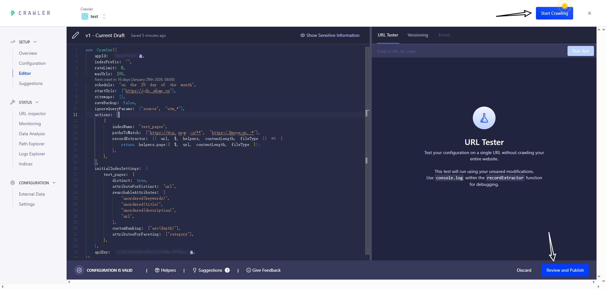

进入该页面即可查看爬虫后的全部信息

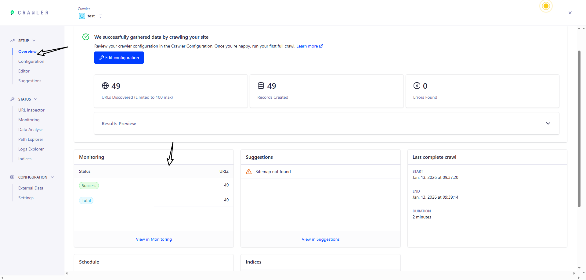

当爬虫结束并成功后，返回 Index 页面，如果出现下面页面的内容即 **代表成功**

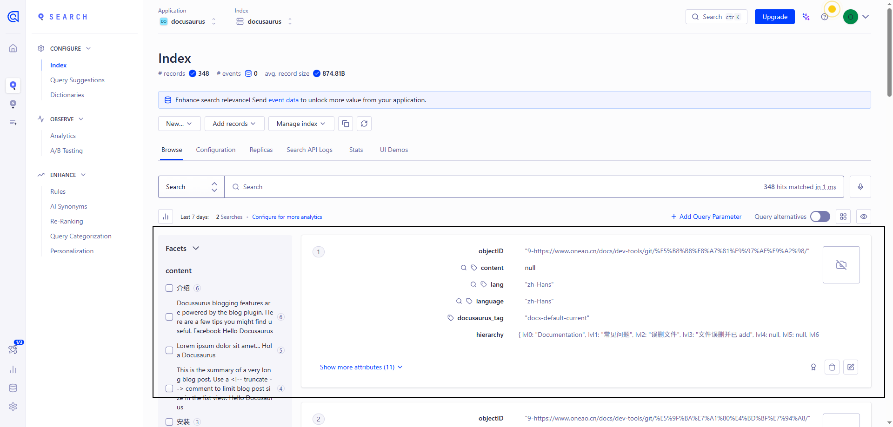

成功后，进入网站进行搜索即可

### 自定义爬虫（Docker）

服务器上安装 `jq` 解析 `json` 文件

```bash
sudo apt update && sudo apt install -y jq
```

在项目根目录下新增 `.env` 和 `.docsearch.json` 文件

```bash title='.env'
ALGOLIA_APP_ID=xxx
ALGOLIA_API_KEY=xxx
```

```json title='.docsearch.json'
{
  // 需要替换
  "index_name": "xxx",
  // 需要替换。网站网址
  "start_urls": ["xxx"],
  // 需要替换。sitemap的网址，docusaurus 默认在根目录下生成 sitemap.xml
  "sitemap_urls": ["xxx"],
  "selectors": {
    "lvl0": {
      "selector": "(//ul[contains(@class,'menu__list')]//a[contains(@class, 'menu__link menu__link--sublist menu__link--active')]/text() | //nav[contains(@class, 'navbar')]//a[contains(@class, 'navbar__link--active')]/text())[last()]",
      "type": "xpath",
      "global": true,
      "default_value": "Documentation"
    },
    "lvl1": "header h1, article h1",
    "lvl2": "article h2",
    "lvl3": "article h3",
    "lvl4": "article h4",
    "lvl5": "article h5, article td:first-child",
    "lvl6": "article h6",
    "text": "article p, article li, article td:last-child"
  },
  "custom_settings": {
    "attributesForFaceting": [
      "type",
      "lang",
      "language",
      "version",
      "docusaurus_tag"
    ],
    "attributesToRetrieve": [
      "hierarchy",
      "content",
      "anchor",
      "url",
      "url_without_anchor",
      "type"
    ],
    "attributesToHighlight": ["hierarchy", "content"],
    "attributesToSnippet": ["content:10"],
    "camelCaseAttributes": ["hierarchy", "content"],
    "searchableAttributes": [
      "unordered(hierarchy.lvl0)",
      "unordered(hierarchy.lvl1)",
      "unordered(hierarchy.lvl2)",
      "unordered(hierarchy.lvl3)",
      "unordered(hierarchy.lvl4)",
      "unordered(hierarchy.lvl5)",
      "unordered(hierarchy.lvl6)",
      "content"
    ],
    "distinct": true,
    "attributeForDistinct": "url",
    "customRanking": [
      "desc(weight.pageRank)",
      "desc(weight.level)",
      "asc(weight.position)"
    ],
    "ranking": [
      "words",
      "filters",
      "typo",
      "attribute",
      "proximity",
      "exact",
      "custom"
    ],
    "highlightPreTag": "<span class='algolia-docsearch-suggestion--highlight'>",
    "highlightPostTag": "</span>",
    "minWordSizefor1Typo": 3,
    "minWordSizefor2Typos": 7,
    "allowTyposOnNumericTokens": false,
    "minProximity": 1,
    "ignorePlurals": true,
    "advancedSyntax": true,
    "attributeCriteriaComputedByMinProximity": true,
    "removeWordsIfNoResults": "allOptional",
    "separatorsToIndex": "_",
    "synonyms": [
      ["js", "javascript"],
      ["ts", "typescript"]
    ]
  }
}
```

然后运行命令

```bash
docker run -it --env-file=.env -e "CONFIG=$(cat docsearch.json | jq -r tostring)" algolia/docsearch-scraper
```

> 报错：algoliasearch.exceptions.RequestException: Method not allowed with this API key
> 这个问题就是权限不够，需要使用 `Admin API Key`

如果出现下面页面的内容即 **代表成功**
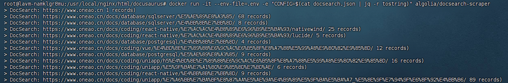
