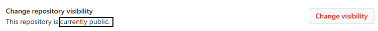
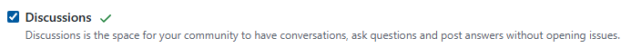
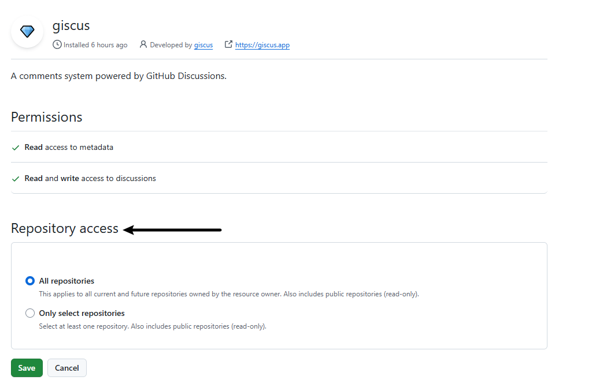

## 1. 准备一个 github 仓库

> 新建 或 已存在 的库都可以

修改配置：`/Settings/General`

保证仓库的 Danger Zone - visibility 是 public的



开启 Features - Discussions 功能



## 2. 配置 [giscus](https://github.com/apps/giscus)

在 github 中开启 giscus 功能，可根据需求选择指定的仓库或公共仓库



开启完毕后进入 [giscus](https://github.com/apps/giscus) 的官网，然后按照顺序配置：

1. 选择语言
2. **仓库**：输入刚刚准备好的 github 仓库地址
3. **页面 ↔️ discussion 映射关系** 选择 **Discussion 的标题包含页面的 pathname**
4. **Discussion 分类** 选择第一个 **Announcements**
5. 其他保持默认即可

然后下滑找到 **启用 giscus** 模块，里面的 `<script>` 信息需要用到，类似：

```html
<script src="https://giscus.app/client.js"
        data-repo="xxxxx"
        data-repo-id="xxxx"
        data-category="xxxx"
        data-category-id="xxxxx"
        data-mapping="pathname"
        data-reactions-enabled="1"
        data-emit-metadata="0"
        data-input-position="bottom"
        data-theme="light"
        data-lang="zh-CN"
        crossorigin="anonymous"
        async>
```

## 3. 在项目中启用

### 3.1 开启博客评论

```bash
pnpm swizzle @docusaurus/theme-classic BlogPostPage
```

- 选择 Eject (Unsafe) 回车
- 选择 YES: I know what I am doing! 回车
- 这时你的项目目录下src/theme/BlogPostPage生成了自定义主题的文件

添加依赖

```bash
pnpm add @docusaurus/theme-common @docusaurus/plugin-content-blog
```

下一步修改文件代码

下面三处标注是我们要修改添加代码的地方。 注意版本不同配置可能存在差异 根据标注自己找放评论的位置。

```js title="/src/theme/BlogPostPage/index.js"
import { HtmlClassNameProvider, ThemeClassNames } from '@docusaurus/theme-common'

import { BlogPostProvider, useBlogPost } from '@docusaurus/theme-common/internal'
import BlogLayout from '@theme/BlogLayout'
import BlogPostItem from '@theme/BlogPostItem'
import BlogPostPageMetadata from '@theme/BlogPostPage/Metadata'
import BlogPostPaginator from '@theme/BlogPostPaginator'
import TOC from '@theme/TOC'
import clsx from 'clsx'
// highlight-start
import React, { useEffect, useRef } from 'react'
// highlight-end

function BlogPostPageContent({ sidebar, children }) {
  const { metadata, toc } = useBlogPost()
  const { nextItem, prevItem, frontMatter } = metadata
  const {
    hide_table_of_contents: hideTableOfContents,
    toc_min_heading_level: tocMinHeadingLevel,
    toc_max_heading_level: tocMaxHeadingLevel,
  } = frontMatter

  // highlight-start
  const commentElement = useRef(null)

  useEffect(() => {
    // Update the document title using the browser API
    let s = document.createElement('script')
    s.src = 'https://giscus.app/client.js'
    s.setAttribute('data-repo', '[你的仓库]')
    s.setAttribute('data-repo-id', '[你的仓库 ID]=')
    s.setAttribute('data-category', '[你的分类名]')
    s.setAttribute('data-category-id', '[你的分类 ID]')
    s.setAttribute('data-mapping', 'pathname')
    s.setAttribute('data-reactions-enabled', '1')
    s.setAttribute('data-emit-metadata', '0')
    s.setAttribute('data-input-position', 'bottom')
    s.setAttribute('data-theme', document.documentElement.getAttribute('data-theme'))
    s.setAttribute('data-lang', 'zh-CN')
    s.setAttribute('crossorigin', 'anonymous')
    s.async = true
    commentElement.current.appendChild(s)
  }, [])
  // highlight-end

  return (
    <BlogLayout
      sidebar={sidebar}
      toc={
        !hideTableOfContents && toc.length > 0
          ? (
              <TOC
                toc={toc}
                minHeadingLevel={tocMinHeadingLevel}
                maxHeadingLevel={tocMaxHeadingLevel}
              />
            )
          : undefined
      }
    >
      <BlogPostItem>{children}</BlogPostItem>

      {(nextItem || prevItem) && (
        <BlogPostPaginator nextItem={nextItem} prevItem={prevItem} />
      )}

      // highlight-start
      <div style={{ marginTop: '20px' }} ref={commentElement}></div>
      // highlight-end

    </BlogLayout>
  )
}

export default function BlogPostPage(props) {
  const BlogPostContent = props.content
  return (
    <BlogPostProvider content={props.content} isBlogPostPage>
      <HtmlClassNameProvider
        className={clsx(
          ThemeClassNames.wrapper.blogPages,
          ThemeClassNames.page.blogPostPage,
        )}
      >
        <BlogPostPageMetadata />
        <BlogPostPageContent sidebar={props.sidebar}>
          <BlogPostContent />
        </BlogPostPageContent>
      </HtmlClassNameProvider>
    </BlogPostProvider>
  )
}
```

### 3.2 开启文档评论

```bash
pnpm swizzle @docusaurus/theme-classic DocItem/Layout
```

- 选择 Eject (Unsafe) 回车
- 选择 YES: I know what I am doing! 回车
- 这时你的项目目录下src/theme/BlogPostPage生成了自定义主题的文件

添加依赖

```bash
pnpm add @docusaurus/plugin-content-docs
```

下一步修改文件代码

下面三处标注是我们要修改添加代码的地方。 注意版本不同配置可能存在差异 根据标注自己找放评论的位置。

```js title="/src/theme/DocItem/Layout/index.js"
import { useDoc } from '@docusaurus/plugin-content-docs/client'
import { useWindowSize } from '@docusaurus/theme-common'
import ContentVisibility from '@theme/ContentVisibility'
import DocBreadcrumbs from '@theme/DocBreadcrumbs'
import DocItemContent from '@theme/DocItem/Content'
import DocItemFooter from '@theme/DocItem/Footer'
import DocItemPaginator from '@theme/DocItem/Paginator'
import DocItemTOCDesktop from '@theme/DocItem/TOC/Desktop'
import DocItemTOCMobile from '@theme/DocItem/TOC/Mobile'
import DocVersionBadge from '@theme/DocVersionBadge'
import DocVersionBanner from '@theme/DocVersionBanner'
import clsx from 'clsx'
// highlight-start
import React, { useEffect, useRef } from 'react'
// highlight-end
import styles from './styles.module.css'
/**
 * Decide if the toc should be rendered, on mobile or desktop viewports
 */
function useDocTOC() {
  const { frontMatter, toc } = useDoc()
  const windowSize = useWindowSize()
  const hidden = frontMatter.hide_table_of_contents
  const canRender = !hidden && toc.length > 0
  const mobile = canRender ? <DocItemTOCMobile /> : undefined
  const desktop
    = canRender && (windowSize === 'desktop' || windowSize === 'ssr')
      ? (
          <DocItemTOCDesktop />
        )
      : undefined
  return {
    hidden,
    mobile,
    desktop,
  }
}
export default function DocItemLayout({ children }) {
  const docTOC = useDocTOC()
  const { metadata } = useDoc()

  // highlight-start
  const commentElement = useRef(null)

  useEffect(() => {
    // Update the document title using the browser API
    let s = document.createElement('script')
    s.src = 'https://giscus.app/client.js'
    s.setAttribute('data-repo', '[你的仓库]')
    s.setAttribute('data-repo-id', '[你的仓库 ID]=')
    s.setAttribute('data-category', '[你的分类名]')
    s.setAttribute('data-category-id', '[你的分类 ID]')
    s.setAttribute('data-mapping', 'pathname')
    s.setAttribute('data-reactions-enabled', '1')
    s.setAttribute('data-emit-metadata', '0')
    s.setAttribute('data-input-position', 'bottom')
    s.setAttribute('data-theme', document.documentElement.getAttribute('data-theme'))
    s.setAttribute('data-lang', 'zh-CN')
    s.setAttribute('crossorigin', 'anonymous')
    s.async = true
    commentElement.current.appendChild(s)
  }, [])
  // highlight-end

  return (
    <div className="row">
      <div className={clsx('col', !docTOC.hidden && styles.docItemCol)}>
        <ContentVisibility metadata={metadata} />
        <DocVersionBanner />
        <div className={styles.docItemContainer}>
          <article>
            <DocBreadcrumbs />
            <DocVersionBadge />
            {docTOC.mobile}
            <DocItemContent>{children}</DocItemContent>

            // highlight-start
            <div style={{ marginTop: '20px' }} ref={commentElement}></div>
            // highlight-end

            <DocItemFooter />
          </article>
          <DocItemPaginator />
        </div>
      </div>
      {docTOC.desktop && <div className="col col--3">{docTOC.desktop}</div>}
    </div>
  )
}
```
