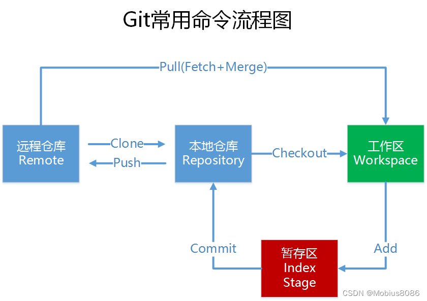
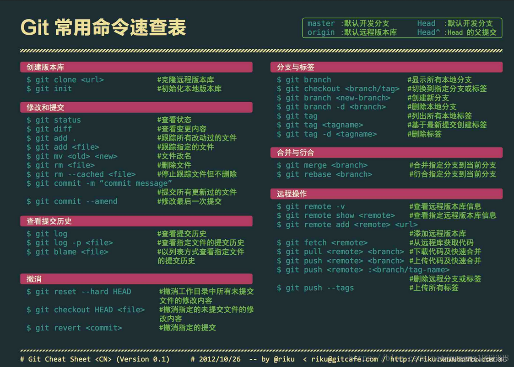

## 安装
### windows
https://git-scm.com/

### linux
```bash
sudo apt install git-all
```
> https://git-scm.com/book/zh/v2/%E8%B5%B7%E6%AD%A5-%E5%AE%89%E8%A3%85-Git

都可以使用 `git -v` 检验是否安装成功


## 配置
查看当前配置
```bash
git config --list
```

设置邮箱和用户名
```bash
git config --global user.name "你的用户名"
git config --global user.email "你的邮箱"
```

设置代理
```bash
git config --global http.proxy http://127.0.0.1:7890
git config --global https.proxy http://127.0.0.1:7890
```

取消代理
```bash
git config --global --unset http.proxy
git config --global --unset https.proxy
```


## 概念


Git 管理代码时，一般会经过这四个地方：
- 工作区：放置代码的 目录/文件夹
- 暂存区：就是相当于一个临时地方，将代码先放到这里
- 本地仓库：电脑的正是仓库，就是相当于将代码正式放到了自己电脑的仓库中，保存代码的历史记录
- 远程仓库：网络/云 上的仓库，方便和别人进行协作

可根据上面的图进行理解

## 基础操作
```bash
// 一般只有初始化仓库的时候才会用到
git init 

// 1.克隆远程仓库的代码
git clone [url]

// 2.提交自己修改过的代码
git add .
git commit -m "注释"  

// 3.拉取远程仓库的最新代码
git pull

// 4.将自己的修改推送到远程仓库
git push origin master
```

## 命令速查表



## 子模块

主仓库就像是一个指向子模块的“快捷方式”，它记录了子模块的位置和版本。子模块是一个独立的仓库，存自己的代码和历史，主仓库只知道子模块在哪里，不会存实际的代码内容。

其实就是相当于两个独立的仓库，push 代码的时候应该先 push **子模块**的代码，避免跟踪警告。

**添加子模块**

```bash
git submodule add <url> <path>
```

例如：

```bash
git submodule add https://github.com/oneao/docusaurus code/docusaurus
```

添加成功后会在主仓库根目录下生成 `.gitmodules` 文件，该文件内有子模块的信息

**初始化子模块并获取内容**

```bash
git submodule update --init --recursive
```

**从主仓库中移除子模块**

```bash
git rm --cached code/docusaurus

// 删除子模块文件夹（如果不需要），提交更改。
```