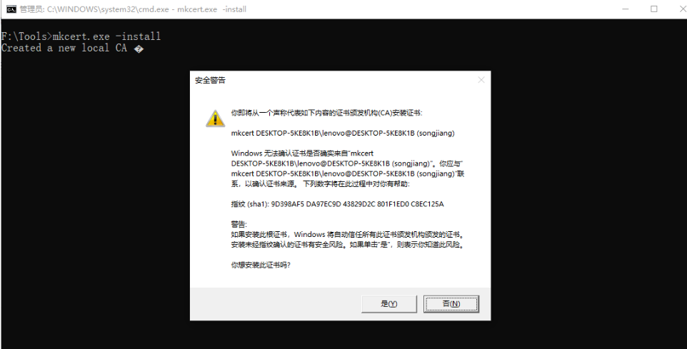
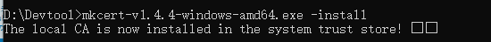
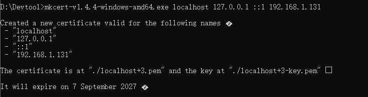

## 本地证书

### [mkcer](https://github.com/FiloSottile/mkcert/releases)

打开 cmd 执行命令

```bash
mkcert-v1.4.4-windows-amd64.exe -install
```

点击 是 即可



安装成功后会提示



生成证书
```bash
mkcert-v1.4.4-windows-amd64.exe localhost 127.0.0.1 ::1 192.168.1.131
```
成功提示



这样就成功啦，然后生成的证书在 **mkcert-v1.4.4-windows-amd64.exe** 的同级目录下

### openssl
参考：https://xinyufeng.net/2024/08/16/%E5%9C%A8-Windows-%E4%B8%8A%E7%94%9F%E6%88%90%E6%9C%AC%E5%9C%B0-SSL-%E8%AF%81%E4%B9%A6%E5%B9%B6%E4%BD%BF%E7%94%A8-HTTPS-%E8%AE%BF%E9%97%AE%E6%9C%AC%E5%9C%B0-Nginx-%E6%9C%8D%E5%8A%A1%E5%99%A8/